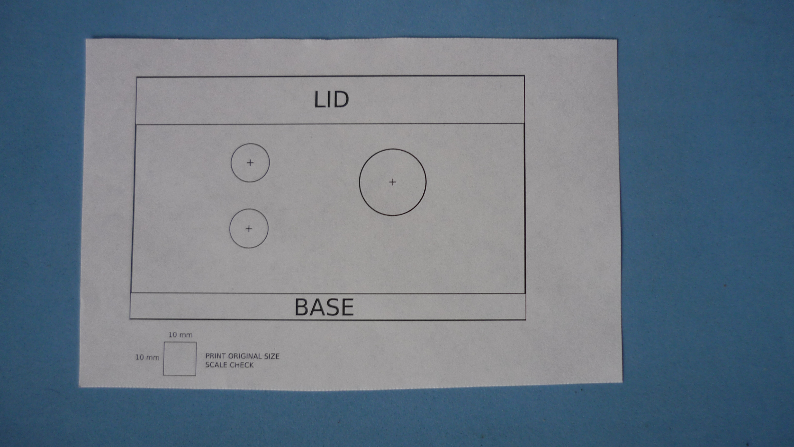

# LED PANEL METER DRILLING TEMPLATE

Different "drilling helpers" for mounting 1 Ethernet and 2 cable gland on a 200x120x75mm waterproof plastic enclosure. 

## Enclosure view from above

## Paper drilling template

## Directory structure

| HINT                        | LINK                                     
|-----------------------------|------------------------------------------
| Paper (PDF)                 | [PAPER_PDF](assets/pdf/drill-layout.pdf)
| Paper (SVG)                 | [PAPER_SVG](assets/img/drill-layout.svg)

