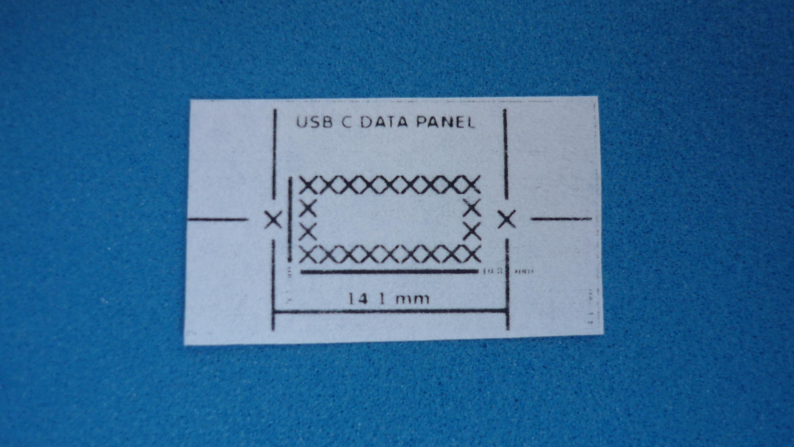
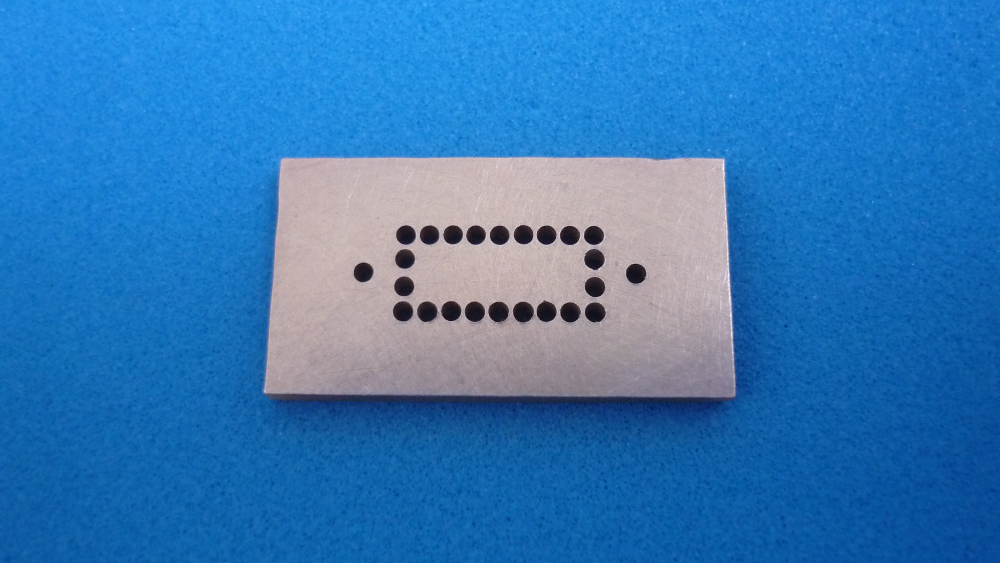
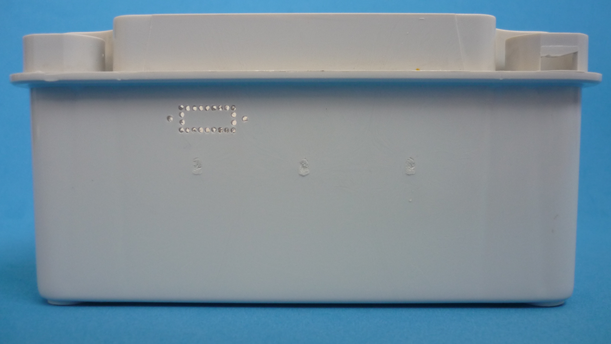
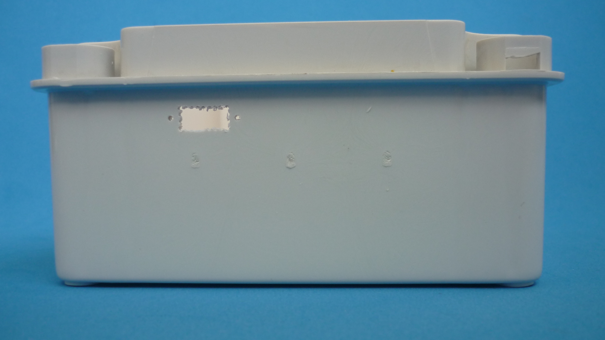
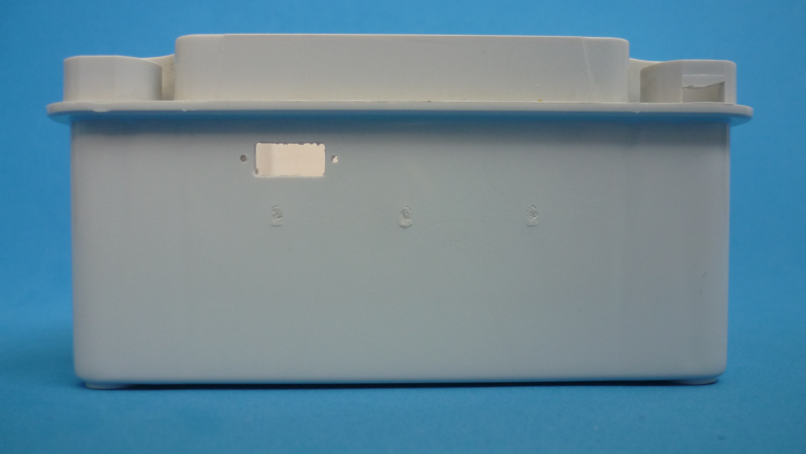

# USB C POWER AND DATA BOARD PANEL CONNECTOR DRILLING TEMPLATE

Different "drilling helpers" for mounting an [USB C POWER AND DATA BOARD PANEL CONNECTOR](assets/pdf/usb-c-board-panel-connector-power-and-data.pdf). Those templates can be produced in different media: paper or PCB. 

## USB C power panel connector

## Paper drilling template

## PCB drilling template

## Enclosure drills

## Enclosure cutout

## Smoothed enclosure cutout

## Directory structure

| HINT                        | LINK                                     
|-----------------------------|------------------------------------------
| PCB Source (KiCad V5.1)     | root folder
| PCB Gerber (single board)   | [GERBER_SINGLE](gerber/single)  
| PCB Gerber (panelized board)| [GERBER_PANEL](gerber/panel)  
| Paper (PDF)                 | [PAPER_PDF](assets/pdf/drill-layout.pdf)
| Paper (SVG)                 | [PAPER_SVG](assets/img/drill-layout.svg)

